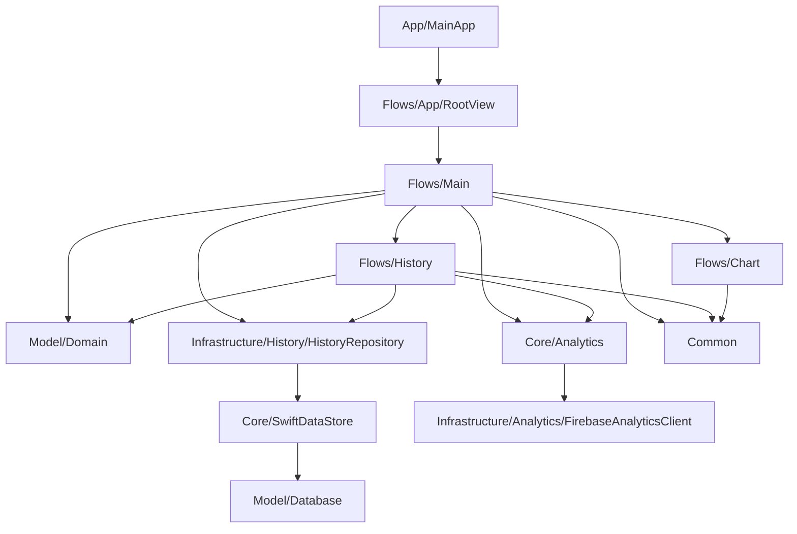

# Архитектура

Документ описывает фактическую архитектуру приложения `Compound Interest` по состоянию на текущую структуру репозитория. Источники фактов: Swift-код в `Compound Interest/`, XcodeGen-конфигурация в `scripts/xcodegen/Application.yml`, README и существующие документы в `docs/`.

## Назначение

`Compound Interest` — SwiftUI iOS-приложение для расчёта сложного процента. Пользователь вводит стартовый капитал, регулярное пополнение, срок и годовую ставку; приложение показывает ключевые показатели, график роста капитала, помесячную детализацию, сохраняет историю расчётов локально и экспортирует детализацию в PDF.

## Слои

## Компоненты

- `App/MainApp.swift` — точка входа. Конфигурирует Firebase, создаёт `AnalyticsClient` и пытается создать репозиторий истории через `HistoryStore.makeRepository()`.
- `Flows/App/RootView.swift` — корневая SwiftUI-композиция. Создаёт `MainViewModel` и показывает `MainView` внутри `NavigationStack`.
- `Flows/Main` — основной сценарий ввода параметров, расчёта результата, отображения метрик, графика, списка помесячного капитала и запуска PDF-экспорта.
- `Flows/History` — экран истории, повторное применение сохранённого расчёта, удаление одной записи или всей истории.
- `Flows/Chart` — presentation-компоненты графика помесячного капитала.
- `Model/Domain` — доменные значения расчёта: `CalculationInput`, `ContributionFrequency`, `InvestmentDurationUnit`, `KeyIndicatorResult`, `HistoryEntry`, `HistoryDay`.
- `Model/Database` — SwiftData-модель истории и план миграций: `HistoryModel`, `HistorySchemaV1`, `HistoryMigrationPlan`.
- `Infrastructure/History` — реализации доступа к истории: SwiftData, in-memory и unavailable-варианты.
- `Core/Analytics` и `Infrastructure/Analytics` — контракт аналитики и реализации Firebase/Noop.
- `Common` — переиспользуемые helpers, extensions и views.

## Поток запуска

1. `MainApp.init()` вызывает `FirebaseApp.configure()`, если Firebase ещё не сконфигурирован.
2. `MainApp` создаёт `FirebaseAnalyticsClient`.
3. `MainApp` пытается создать SwiftData-репозиторий истории через `HistoryStore.makeRepository()`.
4. Если создание истории падает, приложение использует `UnavailableHistoryRepository`; основной экран продолжает работать, но показывает ошибку истории, а навигация к истории недоступна через `isHistoryAvailable`.
5. `RootView` передаёт зависимости в `MainViewModel`.

## Расчёт

`MainViewModel.calculateResult()` строит `CalculationInput` из пользовательского ввода. Обязательные поля: `initialInvestment`, `investmentDuration`, `annualInterestRate`. Если срок меньше или равен нулю, расчёт не выполняется.

Для валидного ввода:

- количество месяцев берётся из `investmentDurationUnit.monthCount(from:)`;
- месячная ставка считается как `annualInterestRate / 100 / 12`;
- в каждом месяце капитал сначала умножается на `1 + monthlyRate`;
- затем добавляется регулярное пополнение, если `ContributionFrequency.shouldContribute(in:)` возвращает `true`;
- итоговые показатели включают общий капитал, внесённую сумму, заработанный процент, доходность и массив помесячного капитала.

Подтверждённое ограничение: текущая формула использует фиксированную месячную ставку от годовой ставки и не документирует эффективную годовую ставку, налоги, комиссии, инфляцию или изменение ставки во времени.

## История

История хранится локально через SwiftData в `Application Support/History/History.store`. `HistoryStore` создаёт `ModelContainer` со схемой `HistorySchemaV1`, отключает CloudKit и исключает директорию истории из backup.

`SwiftDataHistoryRepository`:

- загружает записи от новых к старым по `calculatedAt` и `sequenceNumber`;
- сохраняет новый расчёт только если в тот же локальный день ещё нет эквивалентного `CalculationInput`;
- нормализует отсутствие пополнения и нулевое пополнение через `normalizedForHistoryComparison`;
- поддерживает удаление одной записи и очистку всей истории.

Если запись в хранилище нельзя распарсить в доменные значения, она не попадает в результат `loadAll()`, потому что `HistoryModel.makeEntry()` возвращает `nil`.

## Аналитика

Приложение отправляет только события, описанные в [Product Analytics](../product/analytics.md). В найденном коде события вызываются из `MainViewModel` и `HistoryViewModel`:

- попытка расчёта с outcome;
- открытие истории;
- повторное применение записи;
- старт PDF-экспорта.

Суммы, ставки, сроки и идентификаторы записей не передаются в события согласно документированному контракту аналитики.

## PDF-экспорт

`MonthlyCapitalPDFDocument` реализует `Transferable` и экспортирует `monthlyCapital` как PDF через `UIGraphicsPDFRenderer`. Документ содержит заголовок и таблицу с месяцем и капиталом; при достижении нижнего поля создаётся новая страница.

## Зависимости и конфигурация

- UI: SwiftUI.
- Графики: Charts.
- Локальное хранение: SwiftData.
- Аналитика: `FirebaseAnalyticsCore`.
- Генерация проекта: XcodeGen.
- Генерация ресурсов: SwiftGen.
- Стиль: SwiftLint.
- Release automation: Fastlane.

Конфигурация приложения задаёт portrait-only ориентацию, manual signing, bundle identifier из `scripts/.env`, `IPHONEOS_DEPLOYMENT_TARGET: 26.0`, `SWIFT_VERSION: 5.0` и отключённые Firebase screen reporting, IDFV collection и ad personalization signals.

## Инварианты

- `ViewModel` владеет состоянием flow и обрабатывает пользовательские намерения.
- SwiftUI `View` отображает состояние и передаёт события наверх.
- Доменные типы расчёта живут в `Model/Domain`.
- Persistence-модели и миграции живут в `Model/Database`.
- История доступна через протокол `HistoryRepository`, а не напрямую через SwiftData из UI.
- Analytics вызывается через `AnalyticsClient`.

## Неизвестное

- В репозитории не найден документ с продуктовой политикой точности финансовых расчётов.
- Не найден ADR, объясняющий выбор SwiftData, Firebase, XcodeGen или минимальной версии iOS.
- Не проверялась фактическая работа Firebase DebugView, TestFlight и App Store Connect, потому что это внешние окружения.
